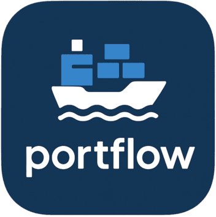

  

 

A personal web app project combining programming knowledge with experience from my previous field in short-sea container shipping.

Every piece of logistics software I have used has failed to deliver on these three requirements: usability, reliability, and modularity.

This project explores solutions from both an operator's perspective and a system developer's viewpoint. Some design decisions are deliberately exploratory rather than optimal, like: choosing microservice architecture over a monolith, or TypeScript throughout instead of .NET and C#, despite most of the industry being tied to Microsoft with Windows, O365, and Azure cloud services.